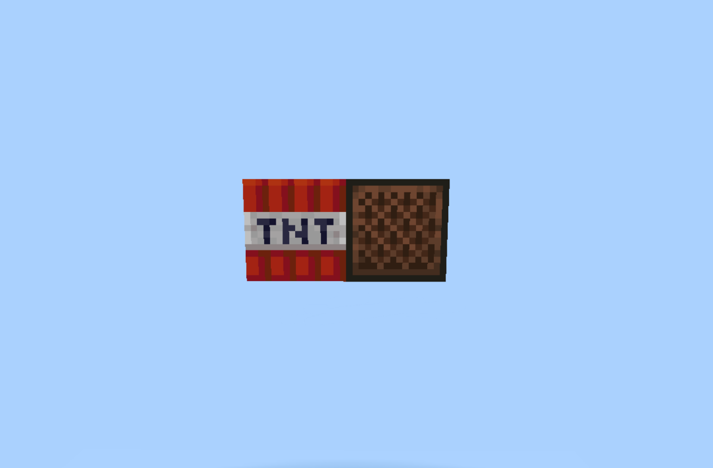
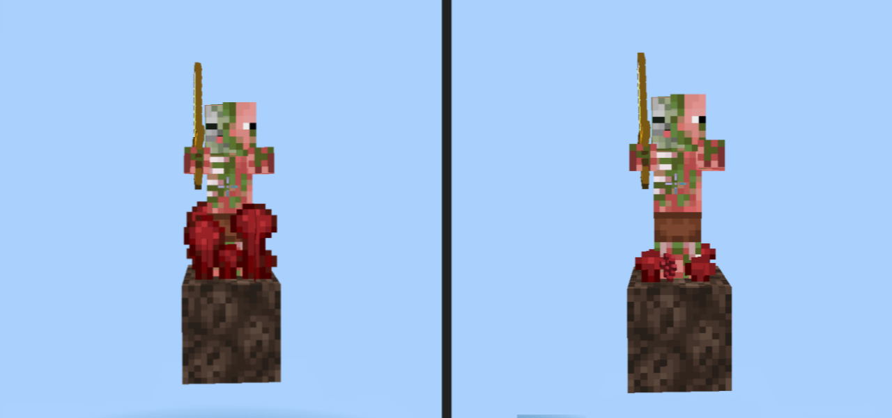
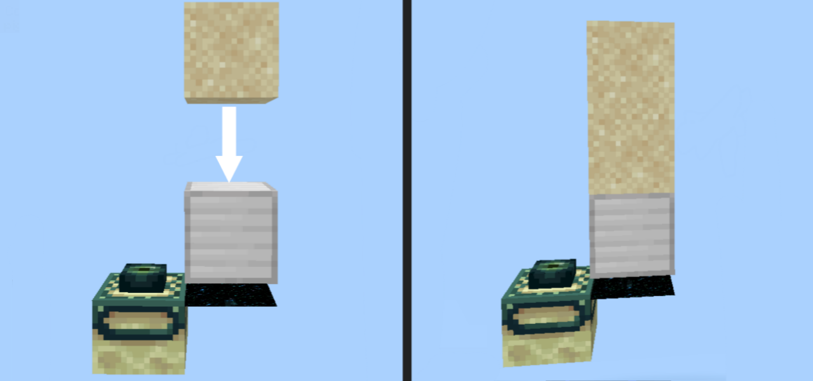
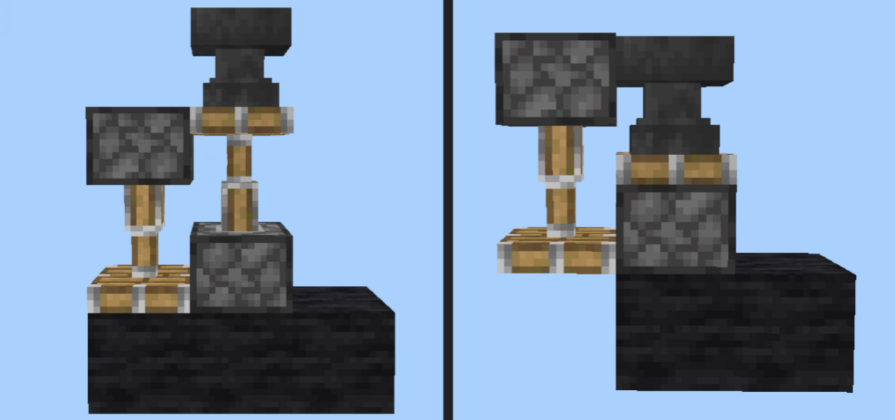
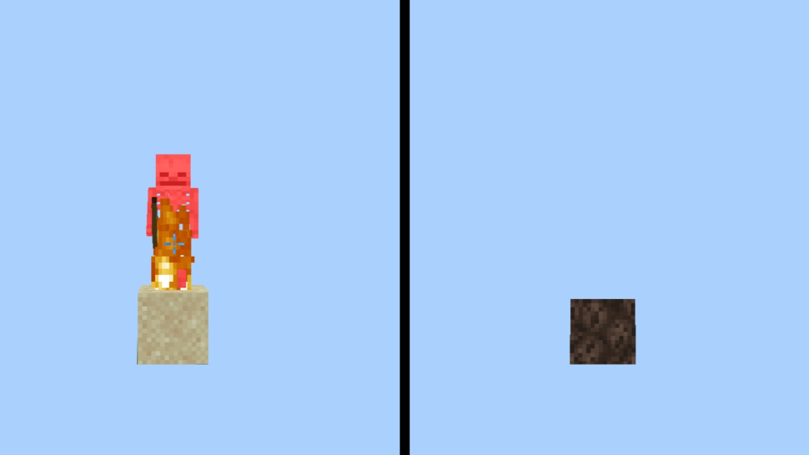
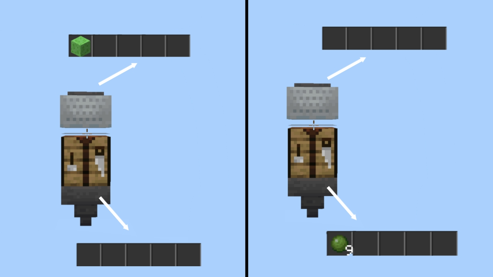

---

# TNT Module

---

## tntDuping

- ## arguments: `<boolean>`
- ## accepts: [ true, false ]

### how to use?


<br><br>

## tntDropAllBlocks

- ## arguments: `<boolean>`
- ## accepts: [ true, false ]

<br>

## tntDropIce

- ## arguments: `<boolean>`
- ## accepts: [ true, false ]

<br>

---

# Entity Module

---

## guardianDropSponges

- ## arguments: `<boolean>`
- ## accepts: [ true, false ]

<br>

## ghastDropQuartz

- ## arguments: `<boolean>`
- ## accepts: [ true, false ]

<br>

## huskDropSand

- ## arguments: `<boolean>`
- ## accepts: [ true, false ]

<br>

## silverfishDropGravel

- ## arguments: `<boolean>`
- ## accepts: [ true, false ]

<br>

## pigmansFarmWarts 

- ## arguments: `<boolean>`
- ## accepts: [ true, false ]

### how to use?


<br><br>

---

# World Module

---

## endPortalGBD

- ## arguments: `<boolean>`
- ## accepts: [ true, false ]

### how to use?


<br><br>

## anvilBedrockBreaker

- ## arguments: `<boolean>`
- ## accepts: [ true, false ]

### how to use?


<br><br>

## cauldronBedrockBreaker

- ## arguments: `<boolean>`
- ## accepts: [ true, false ]

### how to use?


<br><br>

## renewableSoulSand

- ## arguments: `<boolean>`
- ## accepts: [ true, false ]

### how to use?


---

# Tweaks Module

---

## flippinCactus

- ## arguments: `<boolean>`
- ## accepts: [ true, false ]

### how to use?

clicking on one of the following blocks in the list will change rotation.

```
> piston - sticky piston
> dispenser - dropper
> comparator - repeater
> observer
```

<br>

## autoCrafting

- ## arguments: `<boolean>`
- ## accepts: [ true, false ]

### how to use?


[View available recipes](../recipes.md)

<br><br>

## toolChanger

- ## arguments: `<boolean>`
- ## accepts: [ true, false ]

### how to use?


<br><br>