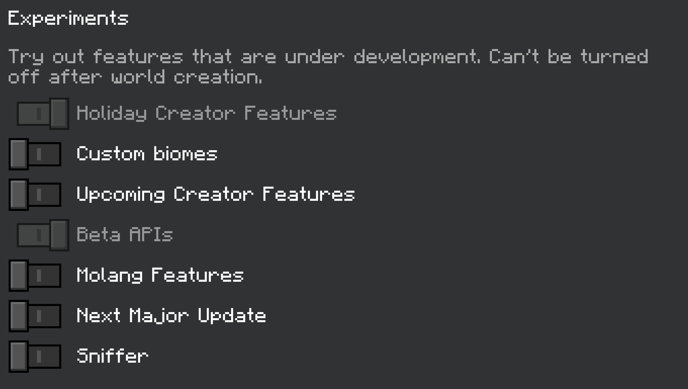

---

# Installation guide

---

### 1. Download the latest [Release](https://github.com/AlecsDeveloper/Sapling/releases)

### 2. Import the addon in your client

### 3. Activate these experimental modes:

---

# Help Commands

---

### `./sapling help` or `./sapling help <module>`

### `./data help`

### `./player server guide`

---

# Alternative Downloads (1.20)
[Addon](https://github.com/AlecsDeveloper/Sapling/releases/download/Beta/SaplingAddon.mcpack)
[CUI](https://github.com/AlecsDeveloper/Sapling/releases/download/Beta/SaplingCUI.mcpack)